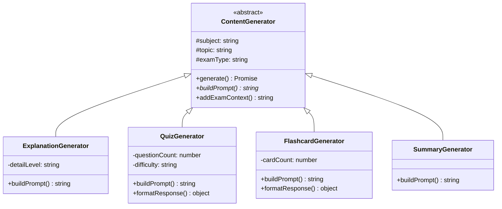
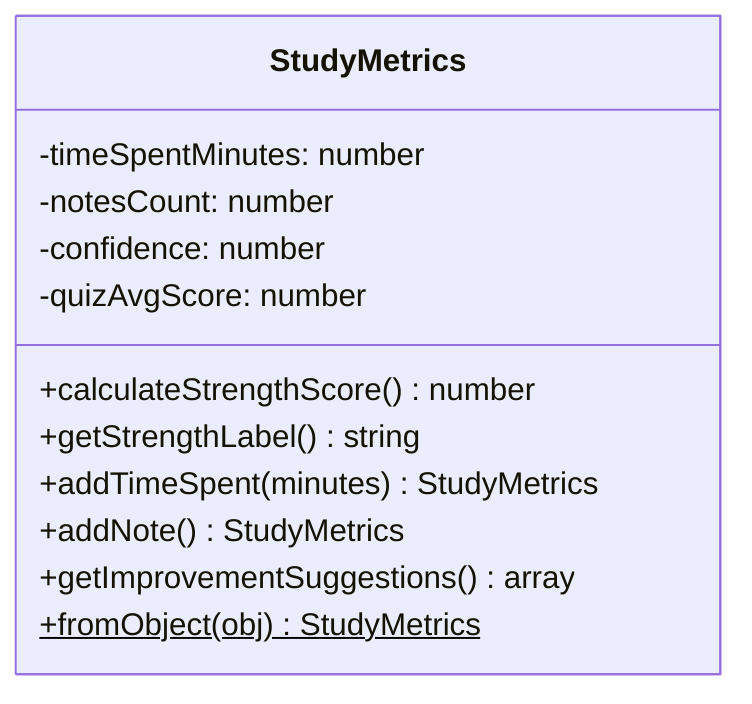
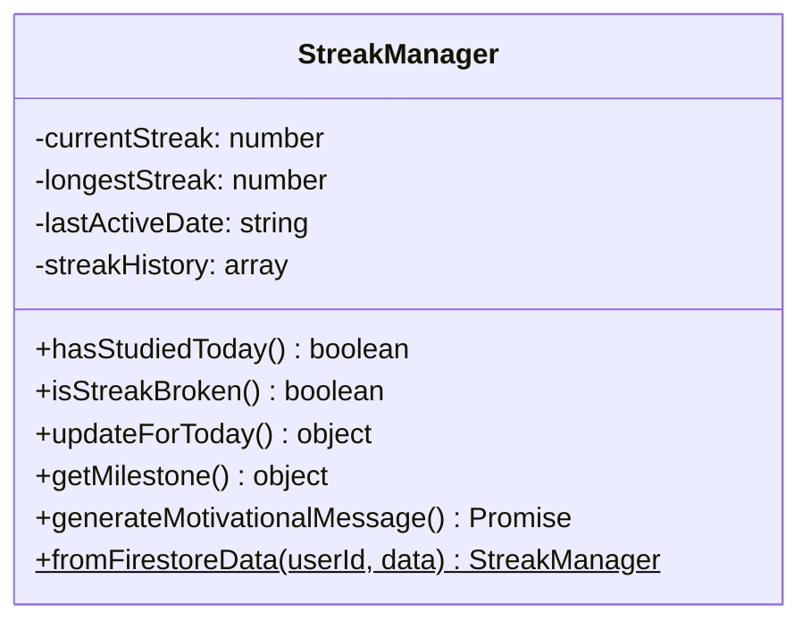
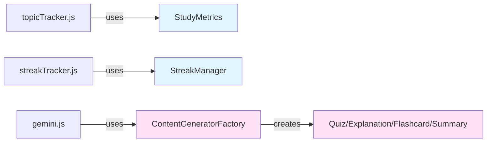
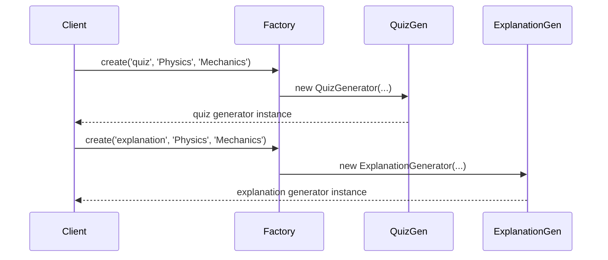
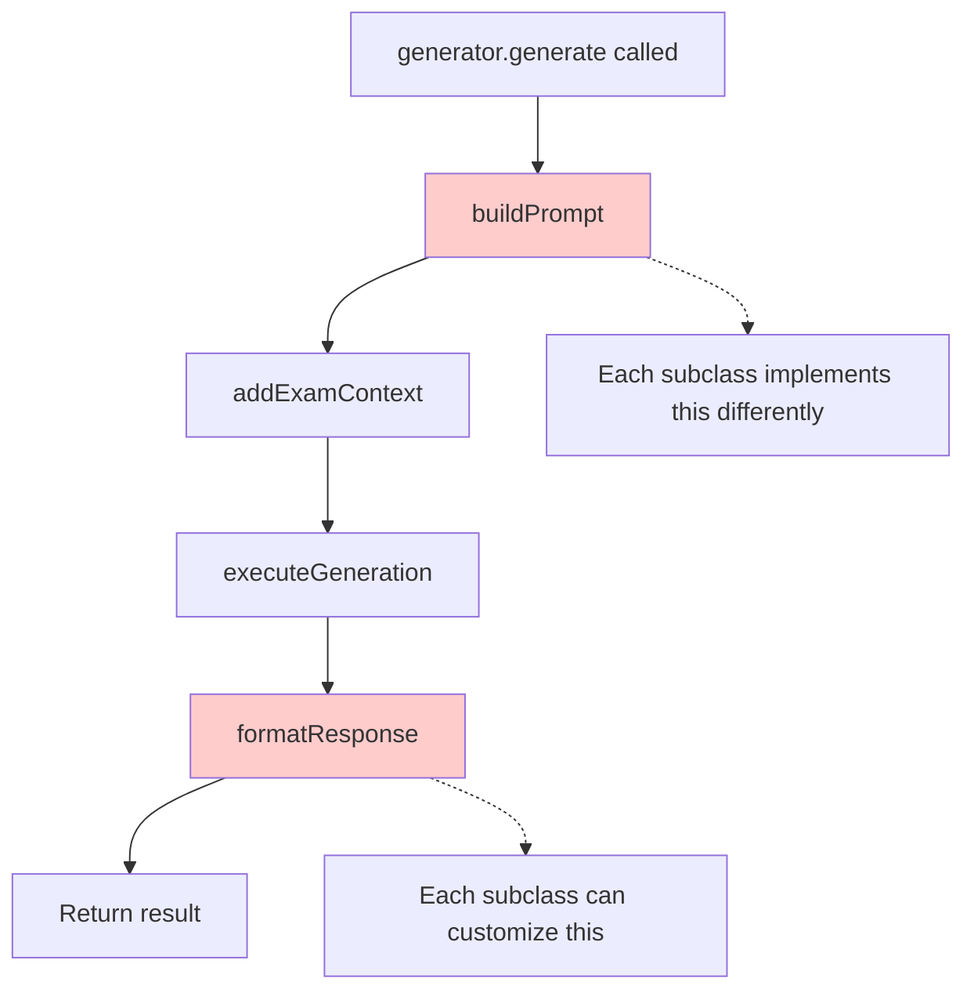
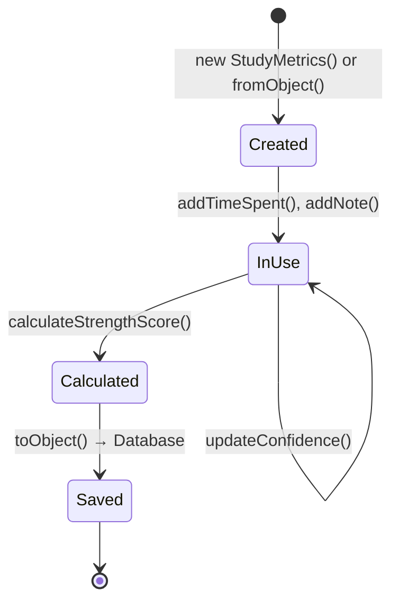
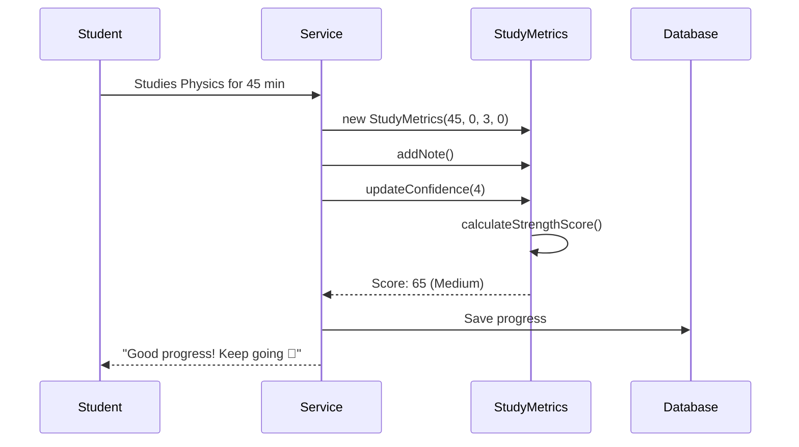

# Class Diagram - Visual Guide

> Simple visual guide to understand our OOP structure

## 1. Main Class Hierarchy



**What this means:**
- `ContentGenerator` is the parent (you can't create it directly)
- 4 children classes inherit from it
- Each child has its own special way of creating content

---

## 2. StudyMetrics Class



**What this does:**
- Tracks how much a student studied a topic
- Calculates if they're "weak", "medium", or "strong"
- Gives suggestions on what to improve

---

## 3. StreakManager Class



**What this does:**
- Tracks daily study streaks (like Snapchat streaks!)
- Checks if you studied today
- Gives motivational messages
- Shows milestones (7 days, 30 days, etc.)

---

## 4. How Services Use Classes



**What this means:**
- Services (the functions) use our classes
- Classes do the heavy lifting
- Clean separation of concerns

---

## 5. Factory Pattern Flow



**What this means:**
- You ask the Factory for what you need
- Factory creates the right type for you
- You don't worry about how it's made

---

## 6. Template Method Pattern



**What this means:**
- Parent class defines the steps
- Child classes fill in the details
- Same process, different implementations

---

## 7. Object Lifecycle



**What this means:**
- Create object
- Use it (add data)
- Calculate results
- Save to database

---

## 8. Real Example Flow



**What this means:**
- Student studies
- We track it with our class
- Calculate their strength
- Save and show feedback

---

## Key Concepts Explained Simply

### 🔒 Encapsulation
**Like a capsule** - data is hidden inside, only accessible through methods
```javascript
// Can't do this: metrics.#timeSpentMinutes (private!)
// Must do this: metrics.timeSpentMinutes (getter)
```

### 👨‍👦 Inheritance
**Like family** - children inherit from parents
```javascript
QuizGenerator extends ContentGenerator
// QuizGenerator gets all ContentGenerator's methods
```

### 🎭 Polymorphism
**Same action, different results**
```javascript
quiz.generate()        // Creates quiz questions
explanation.generate() // Creates explanation
// Same method name, different behavior!
```

### 🏭 Factory Pattern
**Like a factory** - you order, it makes
```javascript
Factory.create('quiz')  // Factory makes a quiz generator
Factory.create('flashcards') // Factory makes flashcard generator
```

---

## Why This Matters

✅ **Easy to maintain** - Each class has one job  
✅ **Easy to extend** - Add new generators without breaking old code  
✅ **Easy to test** - Test each class separately  
✅ **Easy to understand** - Clear structure and relationships  

---

## Quick Reference

| Class | Purpose | Key Method |
|-------|---------|------------|
| StudyMetrics | Track study progress | `calculateStrengthScore()` |
| StreakManager | Track daily streaks | `updateForToday()` |
| ContentGenerator | Generate study content | `generate()` |
| Factory | Create generators | `create(type)` |

---

**Bottom line:** We use proper OOP to make code organized, reusable, and professional! 🎯
