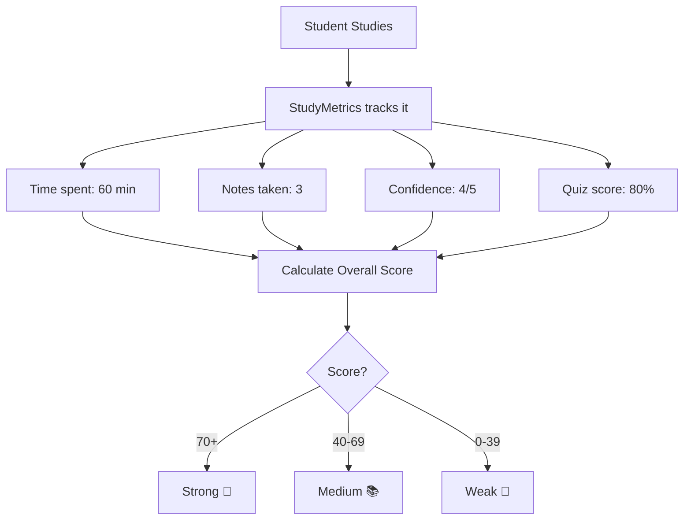
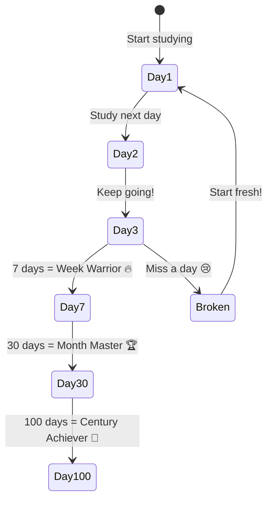
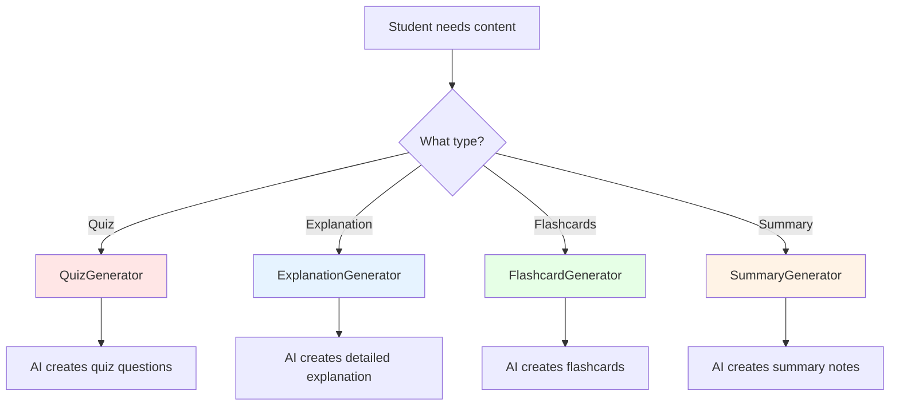
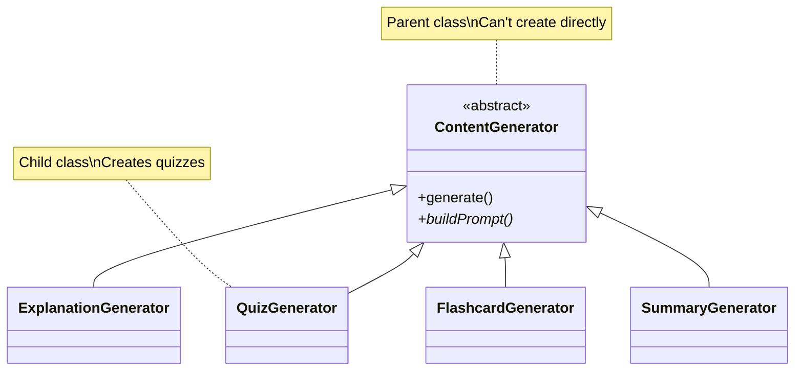
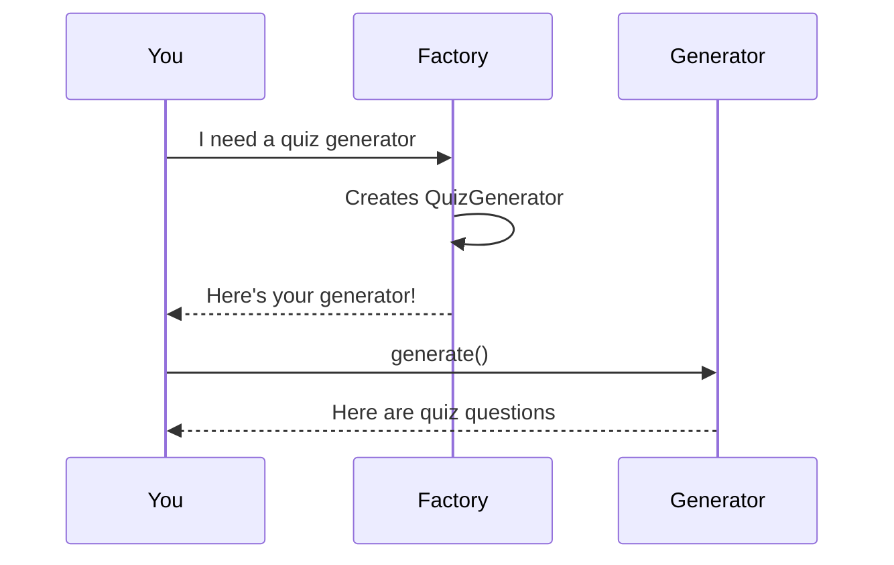
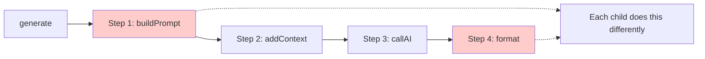
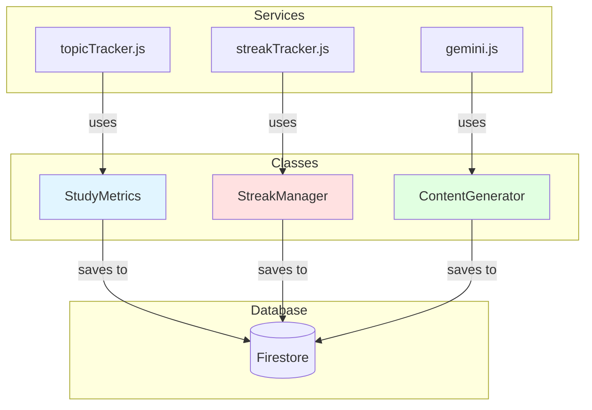
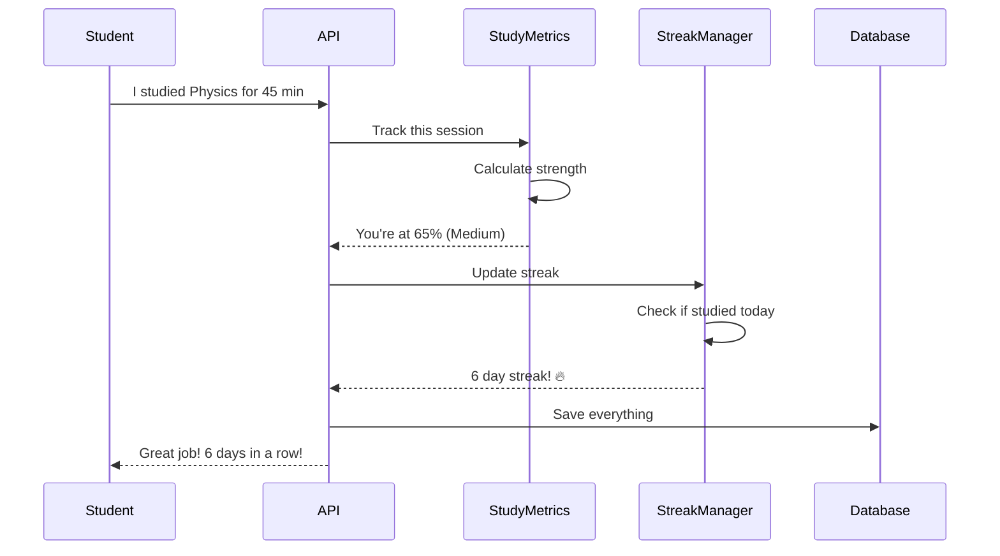

# OOP Architecture - Simple Guide

> How we built StudySaathi with proper Object-Oriented Programming

## What is OOP and Why We Use It?

**OOP = Object-Oriented Programming**

Think of it like building with LEGO blocks:
- Each block (class) has a specific purpose
- Blocks can connect together (inheritance)
- Same block can be used differently (polymorphism)
- Blocks hide their internal parts (encapsulation)

---

## Our 3 Main Classes

### 1. 📊 StudyMetrics - The Progress Calculator

**What it does:** Tracks how well you're learning a topic



**Simple Example:**
```javascript
// Create a tracker
const metrics = new StudyMetrics(60, 3, 4, 80);
//                               time notes conf quiz

// Get results
metrics.calculateStrengthScore(); // Returns: 72
metrics.getStrengthLabel();       // Returns: "strong"
```

**Key Features:**
- ✅ Private data (can't mess with it directly)
- ✅ Automatic calculations
- ✅ Gives improvement suggestions

---

### 2. 🔥 StreakManager - The Motivation Tracker

**What it does:** Tracks daily study streaks (like Snapchat!)



**Simple Example:**
```javascript
// Create streak manager
const streak = new StreakManager(userId, { currentStreak: 5 });

// Check status
streak.hasStudiedToday();  // false
streak.updateForToday();    // Updates to 6 days!

// Get milestone
streak.getMilestone();      // "Next: Week Warrior in 1 day!"
```

**Key Features:**
- ✅ Tracks consecutive days
- ✅ Shows milestones
- ✅ Generates motivational messages
- ✅ Handles streak breaks gracefully

---

### 3. 🤖 ContentGenerator - The AI Content Creator

**What it does:** Creates different types of study content



**The Family Tree:**


**Simple Example:**
```javascript
// Factory creates the right type
const generator = ContentGeneratorFactory.create(
  'quiz',      // type
  'Physics',   // subject
  'Mechanics'  // topic
);

// Generate content
const quiz = await generator.generate();
// Returns: 5 quiz questions about Mechanics
```

---

## Design Patterns 

### 🏭 Factory Pattern

**Problem:** Creating objects is complicated  
**Solution:** Let a factory do it for you



**Real Code:**
```javascript
// Without Factory (complicated)
const quiz = new QuizGenerator('Physics', 'Mechanics', 'JEE', 10, 'hard');

// With Factory (easy!)
const quiz = ContentGeneratorFactory.create('quiz', 'Physics', 'Mechanics');
```

---

### 📋 Template Method Pattern

**Problem:** Same steps, different details  
**Solution:** Parent defines steps, children fill details



**Example:**
```javascript
// Parent class defines the recipe
class ContentGenerator {
  async generate() {
    const prompt = this.buildPrompt();      // Step 1
    const enhanced = this.addExamContext(); // Step 2
    const result = await this.callAI();     // Step 3
    return this.formatResponse(result);     // Step 4
  }
}

// Child fills in the details
class QuizGenerator extends ContentGenerator {
  buildPrompt() {
    return "Create 5 quiz questions..."; // Custom for quiz
  }
}
```

---

## How Everything Connects



**What this means:**
1. Services handle API requests
2. Classes do the actual work
3. Everything saves to database

---

## Real-World Example

Let's see how a student studying Physics uses our OOP system:



**The Code:**
```javascript
// 1. Track study time
const metrics = new StudyMetrics(45, 2, 3, 0);
metrics.addTimeSpent(30);  // Studied 30 more minutes
metrics.addNote();          // Took another note
const score = metrics.calculateStrengthScore(); // 58

// 2. Update streak
const streak = new StreakManager(userId);
const result = streak.updateForToday();
// { currentStreak: 6, message: "Amazing! Keep it up! 🔥" }

// 3. Generate content
const quiz = ContentGeneratorFactory.create('quiz', 'Physics', 'Mechanics');
const questions = await quiz.generate();
```

---

## OOP Principles Explained

### 🔒 Encapsulation (Data Hiding)

**What:** Keep data private, access through methods

```javascript
class StudyMetrics {
  #timeSpent;  // Private (# makes it private)
  
  // Can't do: metrics.#timeSpent = -100 ❌
  // Must use: metrics.timeSpent = 100 ✅
  
  set timeSpent(value) {
    if (value < 0) throw new Error('Invalid!');
    this.#timeSpent = value;
  }
}
```

**Why:** Protects data from being messed up

---

### 👨‍👦 Inheritance (Family Tree)

**What:** Children inherit from parents

```javascript
class ContentGenerator {
  generate() { /* common code */ }
}

class QuizGenerator extends ContentGenerator {
  // Gets generate() for free!
  // Can add quiz-specific stuff
}
```

**Why:** Reuse code, don't repeat yourself

---

### 🎭 Polymorphism (Same Name, Different Behavior)

**What:** Same method, different results

```javascript
const generators = [
  new QuizGenerator(),
  new ExplanationGenerator(),
  new FlashcardGenerator()
];

// All have generate(), but each does it differently
generators.forEach(g => g.generate());
```

**Why:** Treat different objects the same way

---

### 🎯 Abstraction (Hide Complexity)

**What:** Simple interface, complex inside

```javascript
// Simple to use
const generator = Factory.create('quiz', 'Physics', 'Mechanics');
const quiz = await generator.generate();

// Complex inside (you don't need to know!)
// - Builds prompt
// - Calls AI
// - Parses response
// - Formats output
```

**Why:** Easy to use, hard to break

---

## Benefits of Our OOP Design

| Benefit | What It Means | Example |
|---------|---------------|---------|
| **Maintainable** | Easy to fix bugs | Bug in quiz? Only fix QuizGenerator |
| **Reusable** | Use code multiple times | StudyMetrics used everywhere |
| **Testable** | Easy to test | Test each class separately |
| **Extensible** | Easy to add features | Add new generator? Just extend base class |
| **Readable** | Easy to understand | Clear class names and structure |

---

## File Structure

```
backend/src/
├── models/                    # Our OOP classes
│   ├── StudyMetrics.js       # Progress calculator
│   ├── StreakManager.js      # Streak tracker
│   └── ContentGenerator.js   # Content creators
│
├── services/                  # Services using classes
│   ├── topicTracker.js       # Uses StudyMetrics
│   ├── streakTracker.js      # Uses StreakManager
│   └── gemini.js             # Uses ContentGenerator
│
└── examples/
    └── oopUsageExamples.js   # How to use everything
```

## Summary

✅ **3 main classes** - StudyMetrics, StreakManager, ContentGenerator  
✅ **Inheritance hierarchy** - ContentGenerator → 4 child classes  
✅ **Design patterns** - Factory, Template Method  
✅ **OOP principles** - Encapsulation, Inheritance, Polymorphism, Abstraction  
✅ **Real-world usage** - Integrated throughout the app  

**Bottom line:** We use OOP to make our code professional, organized, and easy to work with! 🎯


